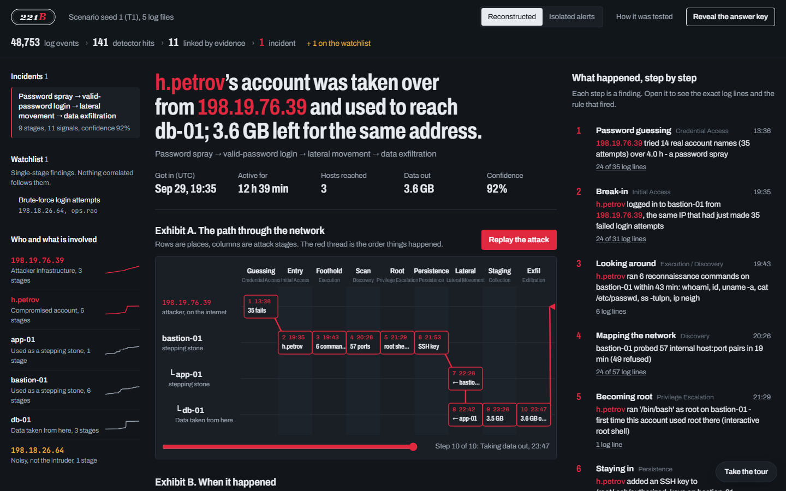
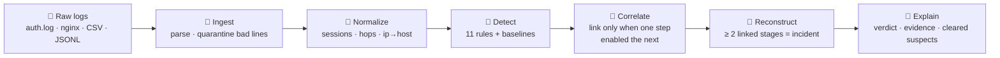
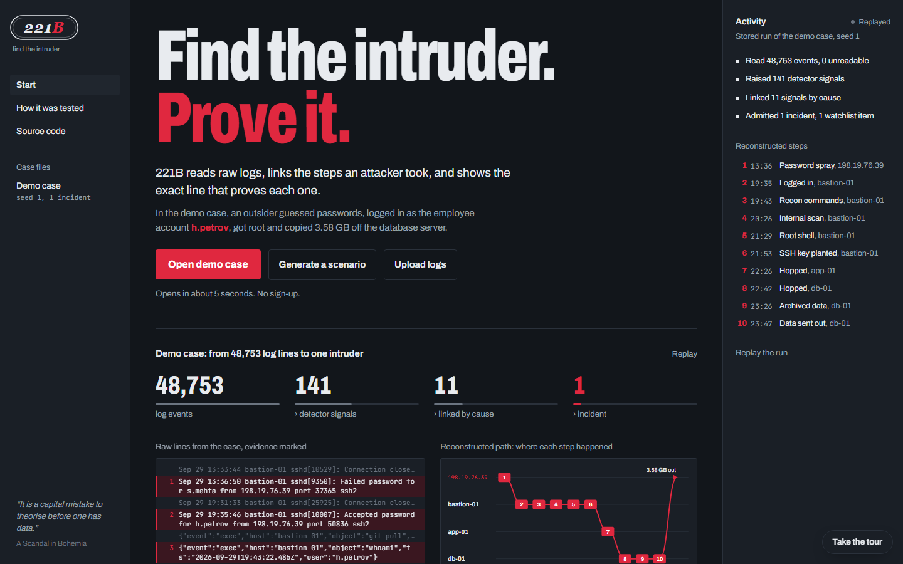
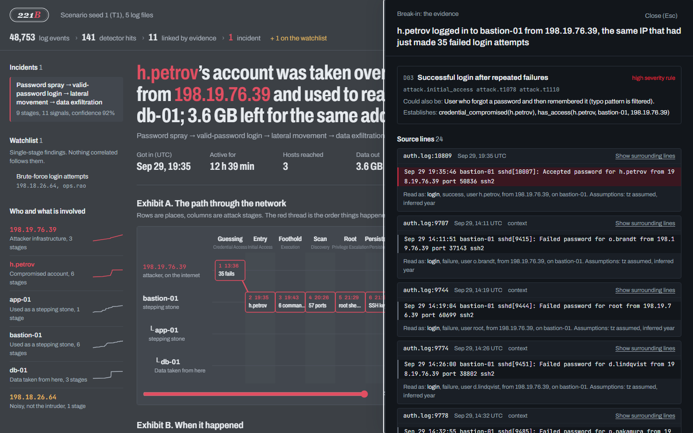
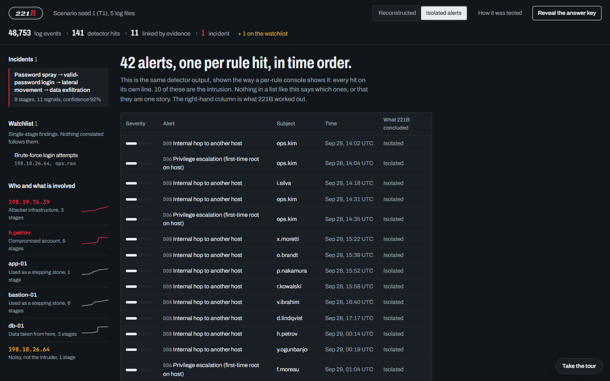
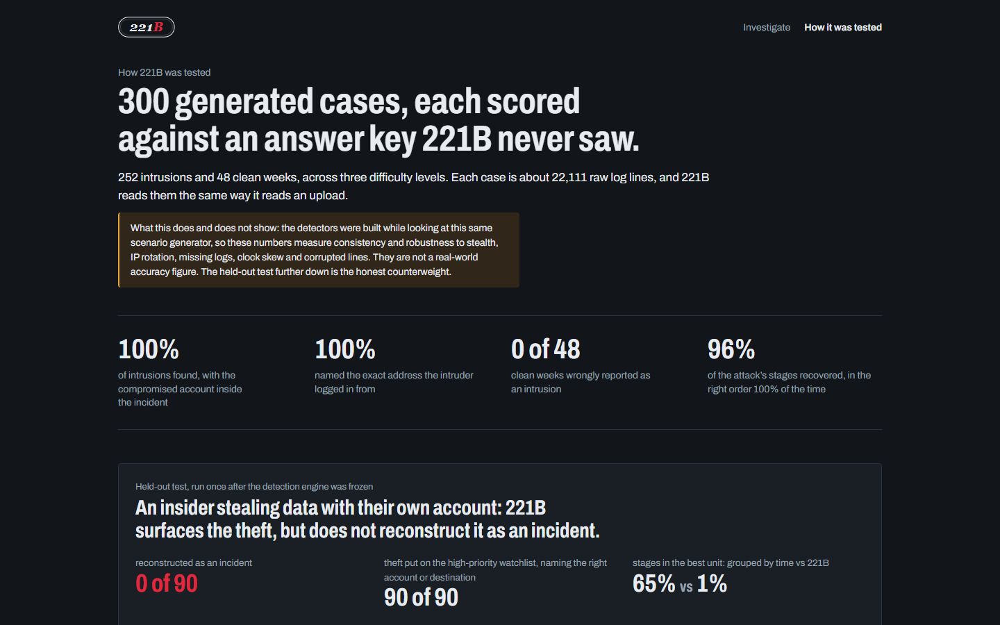

<p align="center"></p>

<h3 align="center">Forensic incident reconstruction from raw logs</h3>

<p align="center"><b>Find the intruder. Prove it.</b> 🔍</p>

<p align="center">
  <a href="https://two21b.onrender.com"></a>
  
  
  
  
  
</p>

<p align="center">
  🌐 <a href="https://two21b.onrender.com">Try it live</a> &nbsp;·&nbsp;
  📊 <a href="docs/benchmark.md">Benchmark</a> &nbsp;·&nbsp;
  🧪 <a href="docs/benchmark_heldout.md">Held-out test</a> &nbsp;·&nbsp;
  📐 <a href="docs/SPEC.md">Spec</a>
</p>

---

## 💡 What is 221B?

Thousands of log lines can hide one attacker among normal activity. Most tools flag events one rule at a time, so the loudest source wins attention, while the real intruder is often quiet: one stolen password, used once.

**221B reads raw logs and rebuilds the attack.** It tells you who got in, from where, how they moved and what they took. Every sentence of the verdict links to the exact log line that proves it.

<p align="center"></p>
<p align="center"><sub>The demo case: 48,753 log lines narrowed to 1 incident, with the attacker's path through three servers.</sub></p>

## 🎯 Why it matters

- 🔊 **Loud is not dangerous.** A bot hammering SSH all afternoon never got in. 221B says so, and shows why.
- 🔗 **Steps, not alerts.** It links two events only when the first made the second possible, never just because they happened close together.
- 🧾 **Proof, not vibes.** No LLM in detection, linking, scoring or explanation. Every claim cites a `file:line`.
- ✅ **Checkable.** Generate a case nobody has seen, get the verdict, then reveal the hidden answer key.

## 🗺️ How it works



**What the engine produces for the demo case:**

| 48,753 | › | 141 | › | 11 | › | **1** |
|:-:|:-:|:-:|:-:|:-:|:-:|:-:|
| log events | | detector signals | | linked by cause | | **incident** |

## 📸 A look inside

<table>
  <tr>
    <td width="50%"><br><sub><b>Start.</b> A 3-second replay of the demo case's real results, and a guided tour.</sub></td>
    <td width="50%"><br><sub><b>Evidence.</b> Every finding opens the raw log lines and the rule that fired.</sub></td>
  </tr>
  <tr>
    <td width="50%"><br><sub><b>Isolated alerts.</b> The same output as a plain rule console shows it, for contrast.</sub></td>
    <td width="50%"><br><sub><b>How it was tested.</b> 300 generated cases, plus a held-out test.</sub></td>
  </tr>
</table>

## 📊 Results

Benchmark of 300 generated cases, scored against a hidden answer key ([full report](docs/benchmark.md)):

| | Result |
|---|---|
| Intrusions found, with the right account | **252 / 252** |
| Exact entry IP named | **252 / 252** |
| Clean weeks wrongly flagged | **0 / 48** |
| Attack stages recovered / in the right order | 96% / 99.7% |
| Deleted log stretches flagged | 91% |

| Same detector output, read as… | Items to review per case | Attack stages in the best item |
|---|---|---|
| every hit is an alert | 25.6 | one per alert |
| hits grouped by time (30 min) | 16.2 | 47% |
| **221B incidents** | **0.85** | **96%** |

> [!NOTE]
> The detectors were built against this same scenario generator, so these numbers show consistency and robustness (stealth, 1 to 40 rotating IPs, 10 to 30% log loss, clock skew, corrupted lines), not real-world accuracy.

**Held-out test, run once after the engine was frozen** ([report](docs/benchmark_heldout.md)): an insider stealing data with their own account. 221B reconstructed **0 / 90** as an incident, but put **90 / 90** on the high-priority watchlist with the right account or destination. That is the design's blind spot, and we left it unfixed so the number stays honest.

## ⚙️ Project specifications

| | |
|---|---|
| **Inputs** | Linux `auth.log` (sshd, sudo, su, useradd, usermod), nginx/Apache access logs, CSV and JSON-lines with an ECS-style field map |
| **Detection** | 11 deterministic rules with Sigma-style metadata and MITRE ATT&CK tags, plus first-seen baselines |
| **Correlation** | Prerequisite/consequence linking (Ning, Cui & Reeves, CCS 2002); an incident needs at least 2 linked stages |
| **Outputs** | Verdict, attack path, session timeline, evidence-cited findings, cleared suspects, answer key |
| **Engine** | Pure Python standard library, deterministic, about 5 s per 50k-line case |
| **Stack** | FastAPI · Pydantic v2 · React 18 + TypeScript + Vite · Tailwind v4 · Docker |
| **Quality** | 74 tests: parsers, property tests, generator round trip, correlation rules, API contract |

## 🚀 How to run

**Easiest:** open the [live demo](https://two21b.onrender.com). It runs on a free instance, so the first visit can take a minute to wake up.

**Locally on Windows:** double-click `run.bat`. It installs, builds and opens http://localhost:8221.

**Locally anywhere** (Python 3.11+, Node 20+):

```bash
pip install -e ".[dev]"
cd frontend && npm ci && npm run build && cd ..
python -m uvicorn backend.api.app:app --port 8221     # open http://localhost:8221
```

<details>
<summary><b>More commands</b></summary>

```bash
python -m pytest                                                 # run the tests
cd frontend && npm run dev                                       # UI dev server on :5173
python -m sim.cli --seed 1 --template T1 --out data/demo_case    # write a scenario's raw logs to disk
python -m eval.sweep --seeds 1..300                              # rerun the benchmark
python -m eval.demo_snapshot                                     # refresh the start screen's demo replay
```
</details>

## 🧪 What to try

1. **Open demo case.** Read the verdict, press **Replay the attack**, click any step to see its log lines.
2. **Generate a scenario** with any number. Pick the attack type and stealth, then click **Reveal the answer key**.
3. **Upload logs.** Try the files in `data/demo_case/` after running the `sim.cli` command above.

## 🧭 Honest limits

- **Insider theft** is surfaced on the watchlist but not reconstructed as an incident (0 / 90 held out).
- **Single-step intruders** who log in and do nothing else stay on the watchlist.
- **Known false positive:** an admin at an odd hour, from a new network, touching new hosts (3 of 300 cases).
- **No Windows EVTX parser yet.** Cases live in memory, so a restart forgets them.

## 🙏 Credits and disclosure

221B reimplements published ideas; no third-party security code or rule text is included. Ideas from Ning, Cui & Reeves (prerequisite correlation), Microsoft Sentinel Fusion (multistage incidents), Splunk ES (risk-based alerting), Sigma, Timesketch, Chainsaw, Jaeger, Elastic Common Schema and CTID Attack Flow. MITRE ATT&CK® names © The MITRE Corporation.

- **AI assistance:** built with Claude Code for design, code, tests and docs. The team directed and reviewed the work.
- **Data:** fully synthetic, from this repo's own generator (`sim/`). No external APIs at runtime.

More detail: [SPEC](docs/SPEC.md) · [RESEARCH](docs/RESEARCH.md) · [DESIGN](docs/DESIGN.md)

<p align="center"><sub>221B Baker Street sends its regards 🔍</sub></p>
